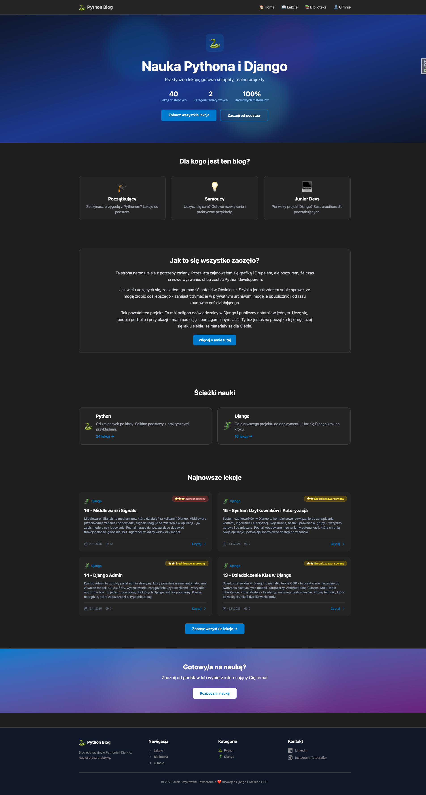
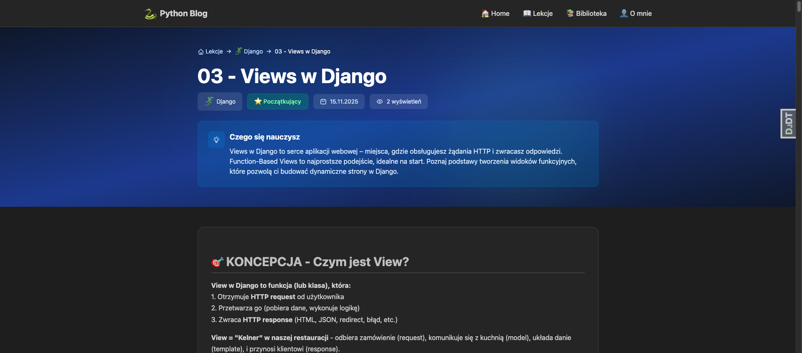
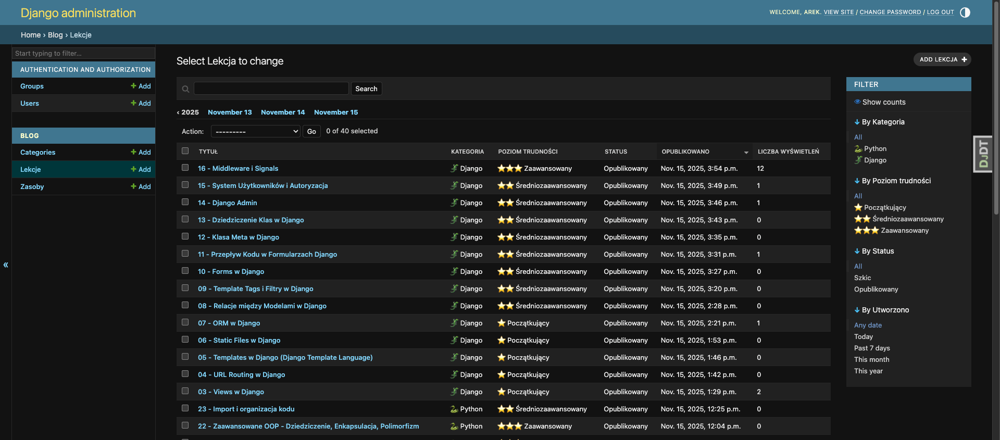

# Django Learning Platform

Live demo: https://smykowski.eu

## Description
Full-stack Django application with 40 programming lessons (for now) covering Python basics to advanced topics.

## Features
- User authentication & authorization
- CRUD operations for lessons and content
- Admin panel for content management
- Responsive design with Tailwind CSS v4
- Deployed on VPS with Nginx, IPv6, Cloudflare

## Tech Stack
- **Backend:** Django 5.x, Python 3.11
- **Frontend:** Tailwind CSS v4, HTML5
- **Database:** PostgreSQL (production), SQLite (dev)
- **Deployment:** VPS (Mikrus), Nginx, Cloudflare
- **Tools:** Git, Docker

## Local Setup
pip install -r requirements.txt
python manage.py migrate
python manage.py runserver

## 📸 Screenshots

### Homepage

*Main landing page with 40 lessons, learning paths, and course statistics*

### Lesson Page

*Interactive lesson content - "Views in Django" with structured learning materials*

### Admin Panel

*Django admin interface for content management with filtering and bulk actions*
